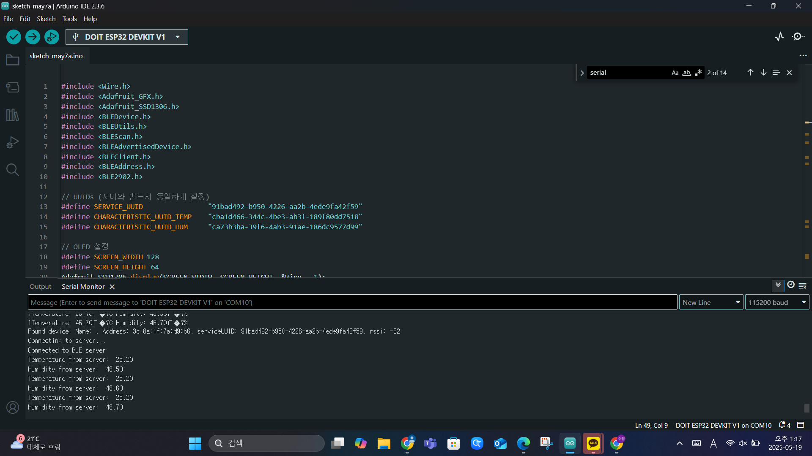
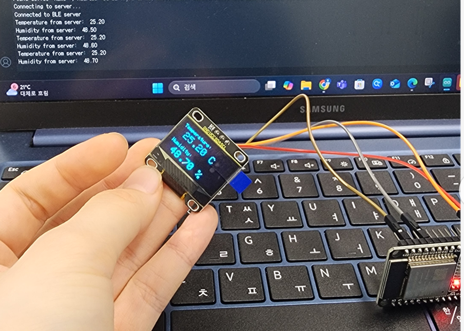
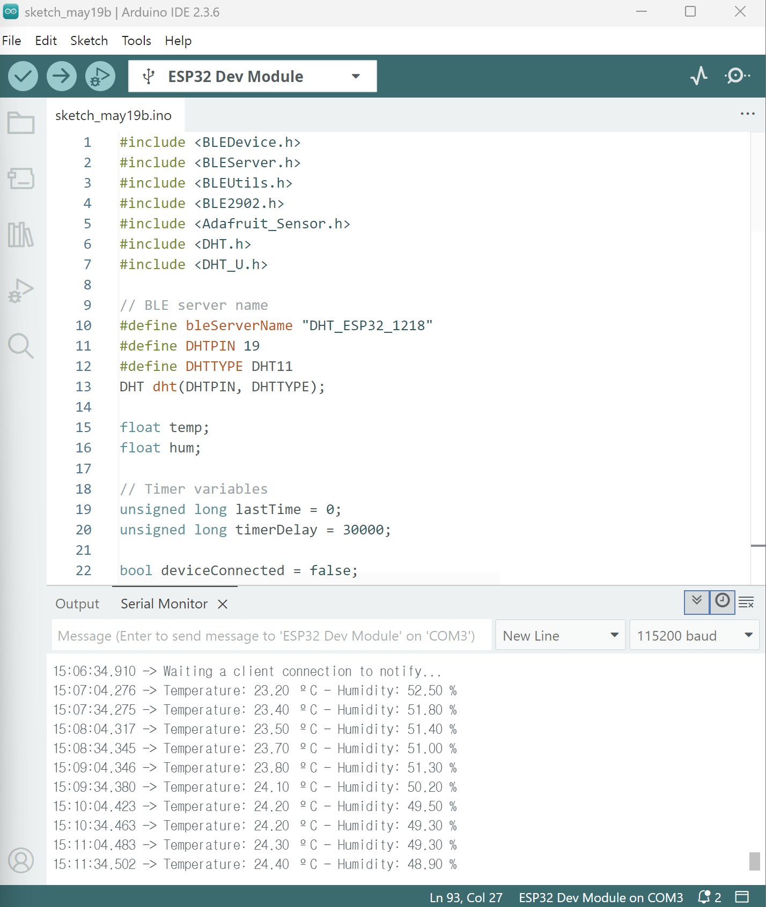
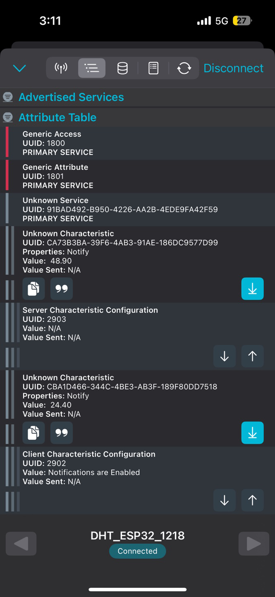

# IoT25-HW05
Assignment 1. BLE & ESP32 BLE Server and Client

---

## Result _ Part1
Arduino

photo of the deployment


## Result _ Part2
Arduino

smartphone

---

## Source code (Common : used in both 5-1 and 5-2)

### Server
```cpp
#include <BLEDevice.h>
#include <BLEServer.h>
#include <BLEUtils.h>
#include <BLE2902.h>
#include <Adafruit_Sensor.h>
#include <DHT.h>
#include <DHT_U.h>

// BLE server name
#define bleServerName "DHT_ESP32"
#define DHTPIN 22
#define DHTTYPE DHT11
DHT dht(DHTPIN, DHTTYPE);

float temp;
float hum;

// Timer variables
unsigned long lastTime = 0;
unsigned long timerDelay = 30000;

bool deviceConnected = false;

// UUIDs
#define SERVICE_UUID "91bad492-b950-4226-aa2b-4ede9fa42f59"
BLECharacteristic dhtTemperatureCharacteristics("cba1d466-344c-4be3-ab3f-189f80dd7518", BLECharacteristic::PROPERTY_NOTIFY);
BLEDescriptor dhtTemperatureDescriptor(BLEUUID((uint16_t)0x2902));
BLECharacteristic dhtHumidityCharacteristics("ca73b3ba-39f6-4ab3-91ae-186dc9577d99", BLECharacteristic::PROPERTY_NOTIFY);
BLEDescriptor dhtHumidityDescriptor(BLEUUID((uint16_t)0x2903));

// BLE callback
class MyServerCallbacks: public BLEServerCallbacks {
  void onConnect(BLEServer* pServer) {
    deviceConnected = true;
  };
  void onDisconnect(BLEServer* pServer) {
    deviceConnected = false;
  }
};

void setup() {
  Serial.begin(115200);
  dht.begin();

  BLEDevice::init(bleServerName);
  BLEServer *pServer = BLEDevice::createServer();
  pServer->setCallbacks(new MyServerCallbacks());

  BLEService *dhtService = pServer->createService(SERVICE_UUID);

  dhtService->addCharacteristic(&dhtTemperatureCharacteristics);
  dhtTemperatureDescriptor.setValue("DHT temperature Celsius");
  dhtTemperatureCharacteristics.addDescriptor(&dhtTemperatureDescriptor);

  dhtService->addCharacteristic(&dhtHumidityCharacteristics);
  dhtHumidityDescriptor.setValue("DHT humidity");
  dhtHumidityCharacteristics.addDescriptor(&dhtHumidityDescriptor);

  dhtService->start();

  BLEAdvertising *pAdvertising = BLEDevice::getAdvertising();
  pAdvertising->addServiceUUID(SERVICE_UUID);
  pAdvertising->start();

  Serial.println("Waiting a client connection to notify...");
}

void loop() {
  if (deviceConnected) {
    if ((millis() - lastTime) > timerDelay) {
      temp = dht.readTemperature();
      hum = dht.readHumidity();

      if (isnan(temp) || isnan(hum)) {
        Serial.println("Failed to read from DHT sensor!");
        return;
      }

      // Notify temperature
      static char tempBuffer[6];
      dtostrf(temp, 6, 2, tempBuffer);
      dhtTemperatureCharacteristics.setValue(tempBuffer);
      dhtTemperatureCharacteristics.notify();
      Serial.print("Temperature: ");
      Serial.print(temp);
      Serial.print(" ºC");

      // Notify humidity
      static char humBuffer[6];
      dtostrf(hum, 6, 2, humBuffer);
      dhtHumidityCharacteristics.setValue(humBuffer);
      dhtHumidityCharacteristics.notify();
      Serial.print(" - Humidity: ");
      Serial.print(hum);
      Serial.println(" %");

      lastTime = millis();
    }
  }
}

### Client
```cpp
5_ 클라이언트

#include <Wire.h>
#include <Adafruit_GFX.h>
#include <Adafruit_SSD1306.h>
#include <BLEDevice.h>
#include <BLEUtils.h>
#include <BLEScan.h>
#include <BLEAdvertisedDevice.h>
#include <BLEClient.h>
#include <BLEAddress.h>
#include <BLE2902.h>

// UUIDs (서버와 반드시 동일하게 설정)
#define SERVICE_UUID                "91bad492-b950-4226-aa2b-4ede9fa42f59"
#define CHARACTERISTIC_UUID_TEMP    "cba1d466-344c-4be3-ab3f-189f80dd7518"
#define CHARACTERISTIC_UUID_HUM     "ca73b3ba-39f6-4ab3-91ae-186dc9577d99"

// OLED 설정
#define SCREEN_WIDTH 128
#define SCREEN_HEIGHT 64
Adafruit_SSD1306 display(SCREEN_WIDTH, SCREEN_HEIGHT, &Wire, -1);

// BLE 변수
static BLEUUID serviceUUID(SERVICE_UUID);
static BLEUUID charUUID_Temp(CHARACTERISTIC_UUID_TEMP);
static BLEUUID charUUID_Hum(CHARACTERISTIC_UUID_HUM);

static boolean doConnect = false;
static boolean connected = false;
static boolean doScan = false;

static BLEAddress *serverAddress;
static BLERemoteCharacteristic* tempCharacteristic;
static BLERemoteCharacteristic* humCharacteristic;

// 데이터 저장 변수
char temperatureValue[16] = "-";
char humidityValue[16] = "-";
bool newData = false;

// BLE 알림 콜백
void notifyCallbackTemp(BLERemoteCharacteristic* pBLERemoteCharacteristic,
                        uint8_t* pData, size_t length, bool isNotify) {
  // length만큼만 복사 후 null 종료
  if (length >= sizeof(temperatureValue)) length = sizeof(temperatureValue) - 1;
  memcpy(temperatureValue, pData, length);
  temperatureValue[length] = '\0';
  newData = true;
  Serial.print("Temperature from server: ");
  Serial.println(temperatureValue);
}

void notifyCallbackHum(BLERemoteCharacteristic* pBLERemoteCharacteristic,
                       uint8_t* pData, size_t length, bool isNotify) {
  if (length >= sizeof(humidityValue)) length = sizeof(humidityValue) - 1;
  memcpy(humidityValue, pData, length);
  humidityValue[length] = '\0';
  newData = true;
  Serial.print("Humidity from server: ");
  Serial.println(humidityValue);
}

// BLE 스캔 콜백
class MyAdvertisedDeviceCallbacks: public BLEAdvertisedDeviceCallbacks {
  void onResult(BLEAdvertisedDevice advertisedDevice) {
    Serial.print("Found device: ");
    Serial.println(advertisedDevice.toString().c_str());

    if (advertisedDevice.haveServiceUUID() && advertisedDevice.isAdvertisingService(serviceUUID)) {
      BLEDevice::getScan()->stop();
      serverAddress = new BLEAddress(advertisedDevice.getAddress());
      doConnect = true;
    }
  }
};

bool connectToServer(BLEAddress pAddress) {
  BLEClient*  pClient  = BLEDevice::createClient();
  Serial.println("Connecting to server...");
  pClient->connect(pAddress);

  BLERemoteService* pRemoteService = pClient->getService(serviceUUID);
  if (pRemoteService == nullptr) {
    Serial.print("Failed to find service UUID: ");
    Serial.println(serviceUUID.toString().c_str());
    pClient->disconnect();
    return false;
  }

  // Temperature
  tempCharacteristic = pRemoteService->getCharacteristic(charUUID_Temp);
  if (tempCharacteristic && tempCharacteristic->canNotify()) {
    tempCharacteristic->registerForNotify(notifyCallbackTemp);
  }

  // Humidity
  humCharacteristic = pRemoteService->getCharacteristic(charUUID_Hum);
  if (humCharacteristic && humCharacteristic->canNotify()) {
    humCharacteristic->registerForNotify(notifyCallbackHum);
  }

  connected = true;
  return true;
}

// OLED 화면 갱신 함수
void updateDisplay() {
  display.clearDisplay();

  // 온도
  display.setTextSize(1);
  display.setCursor(0, 0);
  display.print("Temperature:");
  display.setTextSize(2);
  display.setCursor(0, 12);
  display.print(temperatureValue);
  display.print(" C");

  // 습도
  display.setTextSize(1);
  display.setCursor(0, 38);
  display.print("Humidity:");
  display.setTextSize(2);
  display.setCursor(0, 50);
  display.print(humidityValue);
  display.print(" %");

  display.display();
  newData = false;
}

void setup() {
  Serial.begin(115200);
  Serial.println("BLE Client - Start scanning");

  // OLED 초기화
  if(!display.begin(SSD1306_SWITCHCAPVCC, 0x3C)) {
    Serial.println(F("SSD1306 allocation failed"));
    for(;;);
  }
  display.clearDisplay();
  display.setTextSize(2);
  display.setTextColor(WHITE);
  display.setCursor(0,0);
  display.println("BLE Client");
  display.display();
  delay(1500);

  BLEDevice::init("");

  BLEScan* pBLEScan = BLEDevice::getScan();
  pBLEScan->setAdvertisedDeviceCallbacks(new MyAdvertisedDeviceCallbacks());
  pBLEScan->setInterval(1349);
  pBLEScan->setWindow(449);
  pBLEScan->setActiveScan(true);
  pBLEScan->start(5, false);
}

void loop() {
  if (doConnect == true) {
    if (connectToServer(*serverAddress)) {
      Serial.println("Connected to BLE server");
    } else {
      Serial.println("Failed to connect. Retrying...");
    }
    doConnect = false;
  }

  if (connected && newData) {
    updateDisplay();
  }

  // 필요시 재스캔
  if (!connected && doScan) {
    BLEDevice::getScan()->start(0);
  }

  delay(1000);
}
